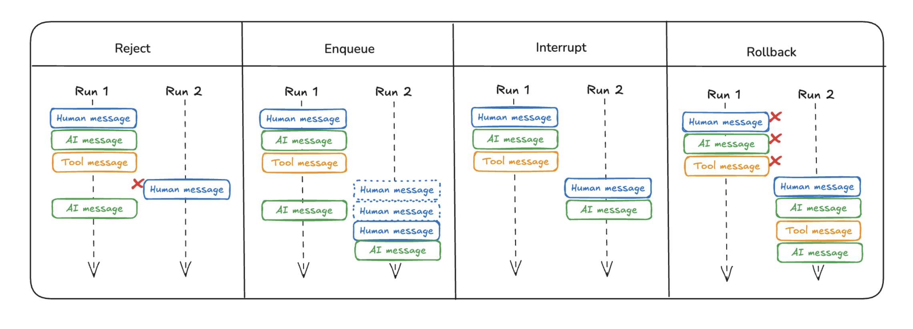

# Double Texting

Seamless handling of [double texting](https://langchain-ai.github.io/langgraph/concepts/double_texting/) is important for handling real-world usage scenarios, especially in chat applications.

Users can send multiple messages in a row before the prior run(s) complete, and we want to ensure that we handle this gracefully.

## Reject

A simple approach is to [reject](https://langchain-ai.github.io/langgraph/cloud/how-tos/reject_concurrent/) any new runs until the current run completes.


```python
%%capture --no-stderr
%pip install -U langgraph_sdk
```


```python
from langgraph_sdk import get_client
url_for_cli_deployment = "http://localhost:8123"
client = get_client(url=url_for_cli_deployment)
```


```python
import httpx
from langchain_core.messages import HumanMessage

# Create a thread
thread = await client.threads.create()

# Create to dos
user_input_1 = "Add a ToDo to follow-up with DI Repairs."
user_input_2 = "Add a ToDo to mount dresser to the wall."
config = {"configurable": {"user_id": "Test-Double-Texting"}}
graph_name = "task_maistro" 

run = await client.runs.create(
    thread["thread_id"],
    graph_name,
    input={"messages": [HumanMessage(content=user_input_1)]}, 
    config=config,
)
try:
    await client.runs.create(
        thread["thread_id"],
        graph_name,
        input={"messages": [HumanMessage(content=user_input_2)]}, 
        config=config,
        multitask_strategy="reject",
    )
except httpx.HTTPStatusError as e:
    print("Failed to start concurrent run", e)
```

    Failed to start concurrent run Client error '409 Conflict' for url 'http://localhost:8123/threads/2b58630e-00fd-4c35-afad-a6b59e9b9104/runs'
    For more information check: https://developer.mozilla.org/en-US/docs/Web/HTTP/Status/409


```python
from langchain_core.messages import convert_to_messages

# Wait until the original run completes
await client.runs.join(thread["thread_id"], run["run_id"])

# Get the state of the thread
state = await client.threads.get_state(thread["thread_id"])
for m in convert_to_messages(state["values"]["messages"]):
    m.pretty_print()
```

    ================================ Human Message =================================
    
    Add a ToDo to follow-up with DI Repairs.
    ================================== Ai Message ==================================
    Tool Calls:
      UpdateMemory (call_6xqHubCPNufS0bg4tbUxC0FU)
     Call ID: call_6xqHubCPNufS0bg4tbUxC0FU
      Args:
        update_type: todo
    ================================= Tool Message =================================
    
    New ToDo created:
    Content: {'task': 'Follow-up with DI Repairs', 'time_to_complete': 30, 'deadline': None, 'solutions': ['Call DI Repairs customer service', 'Email DI Repairs support', 'Check DI Repairs website for updates'], 'status': 'not started'}
    ================================== Ai Message ==================================
    
    I've added a task to follow-up with DI Repairs to your ToDo list. If there's anything else you need, feel free to let me know!


## Enqueue

We can use [enqueue](https://langchain-ai.github.io/langgraph/cloud/how-tos/enqueue_concurrent/https://langchain-ai.github.io/langgraph/cloud/how-tos/enqueue_concurrent/) any new runs until the current run completes.


```python
# Create a new thread
thread = await client.threads.create()

# Create new ToDos
user_input_1 = "Send Erik his t-shirt gift this weekend."
user_input_2 = "Get cash and pay nanny for 2 weeks. Do this by Friday."
config = {"configurable": {"user_id": "Test-Double-Texting"}}
graph_name = "task_maistro" 

first_run = await client.runs.create(
    thread["thread_id"],
    graph_name,
    input={"messages": [HumanMessage(content=user_input_1)]}, 
    config=config,
)

second_run = await client.runs.create(
    thread["thread_id"],
    graph_name,
    input={"messages": [HumanMessage(content=user_input_2)]}, 
    config=config,
    multitask_strategy="enqueue",
)

# Wait until the second run completes
await client.runs.join(thread["thread_id"], second_run["run_id"])

# Get the state of the thread
state = await client.threads.get_state(thread["thread_id"])
for m in convert_to_messages(state["values"]["messages"]):
    m.pretty_print()
```

    ================================ Human Message =================================
    
    Send Erik his t-shirt gift this weekend.
    ================================== Ai Message ==================================
    Tool Calls:
      UpdateMemory (call_svTeXPmWGTLY8aQ8EifjwHAa)
     Call ID: call_svTeXPmWGTLY8aQ8EifjwHAa
      Args:
        update_type: todo
    ================================= Tool Message =================================
    
    New ToDo created:
    Content: {'task': 'Send Erik his t-shirt gift', 'time_to_complete': 30, 'deadline': '2024-11-19T23:59:00', 'solutions': ['Wrap the t-shirt', "Get Erik's address", 'Visit the post office', 'Choose a delivery service'], 'status': 'not started'}
    ================================== Ai Message ==================================
    
    I've updated your ToDo list to send Erik his t-shirt gift this weekend. If there's anything else you need, feel free to let me know!
    ================================ Human Message =================================
    
    Get cash and pay nanny for 2 weeks. Do this by Friday.
    ================================== Ai Message ==================================
    Tool Calls:
      UpdateMemory (call_Cq0Tfn6yqccHH8n0DOucz5OQ)
     Call ID: call_Cq0Tfn6yqccHH8n0DOucz5OQ
      Args:
        update_type: todo
    ================================= Tool Message =================================
    
    New ToDo created:
    Content: {'task': 'Get cash and pay nanny for 2 weeks', 'time_to_complete': 15, 'deadline': '2024-11-17T23:59:00', 'solutions': ['Visit the ATM', 'Calculate the total amount for 2 weeks', 'Hand over the cash to the nanny'], 'status': 'not started'}
    
    Document af1fe011-f3c5-4c1c-b98b-181869bc2944 updated:
    Plan: Update the deadline for sending Erik his t-shirt gift to this weekend, which is by 2024-11-17.
    Added content: 2024-11-17T23:59:00
    ================================== Ai Message ==================================
    
    I've updated your ToDo list to ensure you get cash and pay the nanny for 2 weeks by Friday. Let me know if there's anything else you need!


## Interrupt

We can use [interrupt](https://langchain-ai.github.io/langgraph/cloud/how-tos/interrupt_concurrent/) to interrupt the current run, but save all the work that has been done so far up to that point.


```python
import asyncio

# Create a new thread
thread = await client.threads.create()

# Create new ToDos
user_input_1 = "Give me a summary of my ToDos due tomrrow."
user_input_2 = "Never mind, create a ToDo to Order Ham for Thanksgiving by next Friday."
config = {"configurable": {"user_id": "Test-Double-Texting"}}
graph_name = "task_maistro" 

interrupted_run = await client.runs.create(
    thread["thread_id"],
    graph_name,
    input={"messages": [HumanMessage(content=user_input_1)]}, 
    config=config,
)

# Wait for some of run 1 to complete so that we can see it in the thread 
await asyncio.sleep(1)

second_run = await client.runs.create(
    thread["thread_id"],
    graph_name,
    input={"messages": [HumanMessage(content=user_input_2)]}, 
    config=config,
    multitask_strategy="interrupt",
)

# Wait until the second run completes
await client.runs.join(thread["thread_id"], second_run["run_id"])

# Get the state of the thread
state = await client.threads.get_state(thread["thread_id"])
for m in convert_to_messages(state["values"]["messages"]):
    m.pretty_print()
```

    ================================ Human Message =================================
    
    Give me a summary of my ToDos due tomrrow.
    ================================ Human Message =================================
    
    Never mind, create a ToDo to Order Ham for Thanksgiving by next Friday.
    ================================== Ai Message ==================================
    Tool Calls:
      UpdateMemory (call_Rk80tTSJzik2oY44tyUWk8FM)
     Call ID: call_Rk80tTSJzik2oY44tyUWk8FM
      Args:
        update_type: todo
    ================================= Tool Message =================================
    
    New ToDo created:
    Content: {'task': 'Order Ham for Thanksgiving', 'time_to_complete': 30, 'deadline': '2024-11-22T23:59:59', 'solutions': ['Check local grocery stores for availability', 'Order online from a specialty meat provider', 'Visit a local butcher shop'], 'status': 'not started'}
    ================================== Ai Message ==================================
    
    I've added the task "Order Ham for Thanksgiving" to your ToDo list with a deadline of next Friday. If you need any more help, feel free to ask!


We can see the initial run is saved, and has status `interrupted`.


```python
# Confirm that the first run was interrupted
print((await client.runs.get(thread["thread_id"], interrupted_run["run_id"]))["status"])
```

    interrupted


## Rollback

We can use [rollback](https://langchain-ai.github.io/langgraph/cloud/how-tos/rollback_concurrent/) to interrupt the prior run of the graph, delete it, and start a new run with the double-texted input.


```python
# Create a new thread
thread = await client.threads.create()

# Create new ToDos
user_input_1 = "Add a ToDo to call to make appointment at Yoga."
user_input_2 = "Actually, add a ToDo to drop by Yoga in person on Sunday."
config = {"configurable": {"user_id": "Test-Double-Texting"}}
graph_name = "task_maistro" 

rolled_back_run = await client.runs.create(
    thread["thread_id"],
    graph_name,
    input={"messages": [HumanMessage(content=user_input_1)]}, 
    config=config,
)

second_run = await client.runs.create(
    thread["thread_id"],
    graph_name,
    input={"messages": [HumanMessage(content=user_input_2)]}, 
    config=config,
    multitask_strategy="rollback",
)

# Wait until the second run completes
await client.runs.join(thread["thread_id"], second_run["run_id"])

# Get the state of the thread
state = await client.threads.get_state(thread["thread_id"])
for m in convert_to_messages(state["values"]["messages"]):
    m.pretty_print()
```

    ================================ Human Message =================================
    
    Actually, add a ToDo to drop by Yoga in person on Sunday.
    ================================== Ai Message ==================================
    
    It looks like the task "Drop by Yoga in person" is already on your ToDo list with a deadline of November 19, 2024. Would you like me to update the deadline to the upcoming Sunday instead?


The initial run was deleted.


```python
# Confirm that the original run was deleted
try:
    await client.runs.get(thread["thread_id"], rolled_back_run["run_id"])
except httpx.HTTPStatusError as _:
    print("Original run was correctly deleted")
```

    Original run was correctly deleted


### Summary 

We can see [all the methods summarized](https://langchain-ai.github.io/langgraph/concepts/double_texting/):


